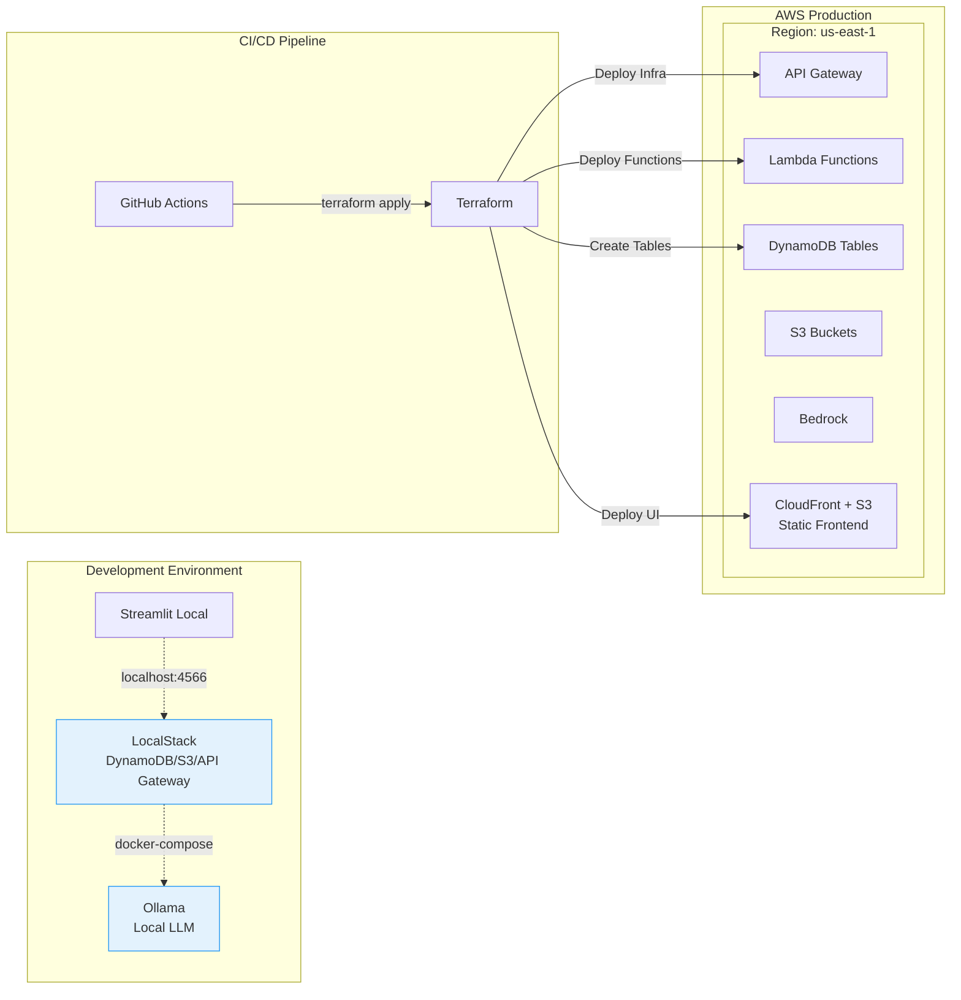
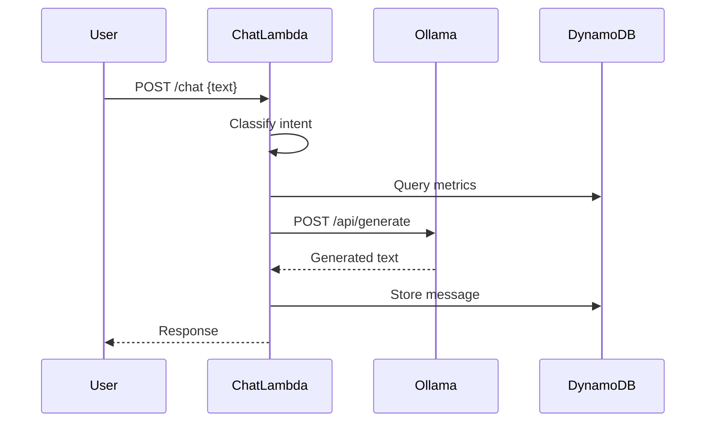
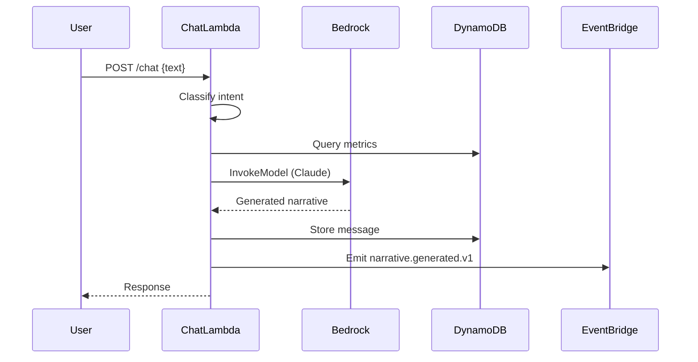
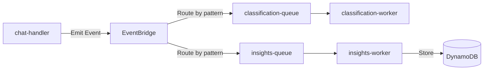
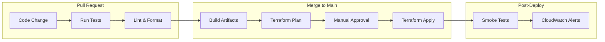
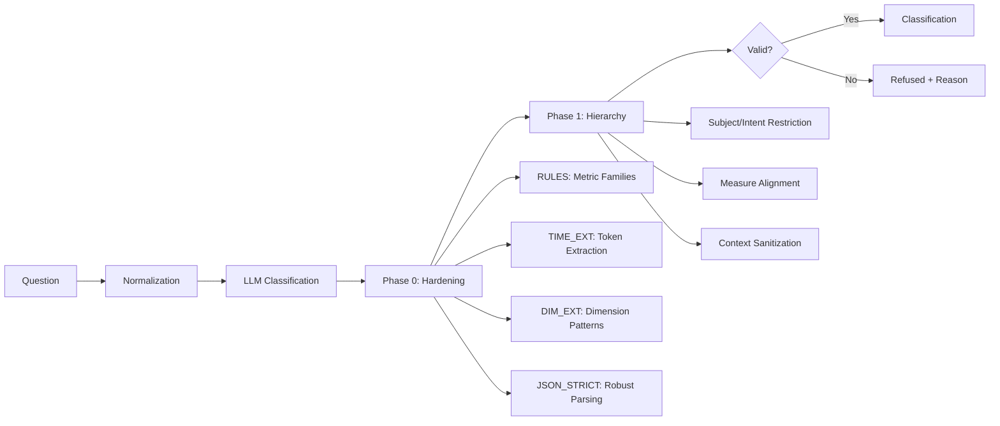

# 🏗️ SalesTalk Architecture Overview

**Version:** 1.0  
**Author:** Architect Agent  
**Date:** November 2025  
**Status:** Phase 1 - Foundation

---

## 📋 Executive Summary

SalesTalk is a **serverless, multi-tenant conversational intelligence platform** built on AWS, designed for scalability, cost-efficiency, and strong data isolation. This document defines the system architecture, deployment topology, multi-tenant isolation strategy, and non-functional requirements.

**Core Architectural Principles:**
1. **Serverless-First:** AWS Lambda + API Gateway for low operational overhead
2. **Per-Tenant Isolation:** Dedicated DynamoDB tables per tenant for security and compliance
3. **Event-Driven:** Asynchronous processing via EventBridge/SQS
4. **AI-Context Separation:** Tenant-aware AI reasoning with strict data boundaries
5. **Infrastructure Parity:** LocalStack + Ollama mirror production AWS + Bedrock
6. **Cost-Aware Design:** Optimized for <100 tenants initially, scaling to 1K+

---

## 🎯 Architecture Goals

| Goal | Description | Success Metric |
|------|-------------|----------------|
| **Multi-Tenant Security** | Zero cross-tenant data leakage | 100% table-level isolation |
| **Low Latency** | Fast conversational responses | P95 < 2s |
| **Cost Efficiency** | Minimize idle costs | <$1/tenant/month idle |
| **Developer Experience** | Seamless local development | Local stack startup < 30s |
| **Scalability** | Support 1K+ tenants | Auto-scaling DynamoDB |
| **Observability** | Full tracing per tenant | 100% request traced |

---

## 🏛️ System Architecture

### High-Level Component Diagram

```mermaid
flowchart TB
    subgraph "User Layer"
        UI[Streamlit Frontend<br/>S3 + CloudFront]
    end
    
    subgraph "API Layer"
        APIGW[API Gateway<br/>HTTP API]
        Auth[Cognito<br/>JWT + tenantId]
    end
    
    subgraph "Compute Layer"
        ChatLambda[Lambda: chat-handler<br/>Classify → Fetch → AI → Store]
        TenantLambda[Lambda: tenant-onboard<br/>Create Tables + Metadata]
        MetricsLambda[Lambda: metrics-handler<br/>Ingest & Aggregate]
        InsightsLambda[Lambda: insights-worker<br/>Async Jobs]
    end
    
    subgraph "AI Layer"
        Classifier[TRM Classifier<br/>Intent/Subject/Measure]
        Bedrock[AWS Bedrock<br/>Claude/Titan]
        Ollama[Ollama Local<br/>Mistral/Llama3]
    end
    
    subgraph "Data Layer - Per Tenant"
        TenantDB[(DynamoDB<br/>tenant-{id}-messages)]
        TenantMetrics[(DynamoDB<br/>tenant-{id}-metrics)]
        TenantS3[(S3<br/>tenant-{id}/artifacts)]
    end
    
    subgraph "Global Data Layer"
        GlobalMeta[(DynamoDB<br/>tenants-metadata)]
    end
    
    subgraph "Event Bus"
        EventBridge[EventBridge<br/>Event Router]
        SQS[SQS Queues<br/>Async Tasks]
    end
    
    subgraph "Observability"
        CW[CloudWatch<br/>Logs + Metrics]
        XRay[X-Ray<br/>Distributed Tracing]
    end
    
    UI -->|HTTPS| APIGW
    APIGW -->|Authorize| Auth
    APIGW --> ChatLambda
    APIGW --> TenantLambda
    APIGW --> MetricsLambda
    
    ChatLambda -->|Classify| Classifier
    ChatLambda -->|Query| TenantDB
    ChatLambda -->|Query| TenantMetrics
    ChatLambda -->|Generate| Bedrock
    ChatLambda -->|Store| TenantDB
    ChatLambda -->|Archive| TenantS3
    ChatLambda -->|Emit| EventBridge
    
    TenantLambda -->|Create| TenantDB
    TenantLambda -->|Create| TenantMetrics
    TenantLambda -->|Register| GlobalMeta
    
    MetricsLambda -->|Store| TenantMetrics
    
    EventBridge -->|Route| SQS
    SQS -->|Trigger| InsightsLambda
    
    InsightsLambda -->|Read| TenantDB
    InsightsLambda -->|Write| TenantDB
    
    ChatLambda -.->|Trace| XRay
    ChatLambda -.->|Log| CW
    TenantLambda -.->|Log| CW
    
    style TenantDB fill:#fef4e6,stroke:#f5b041
    style TenantMetrics fill:#fef4e6,stroke:#f5b041
    style TenantS3 fill:#fef4e6,stroke:#f5b041
```

### Deployment Architecture



---

## 🔐 Multi-Tenant Isolation Strategy

### Table-Level Isolation

Each tenant receives **dedicated DynamoDB tables** for complete data segregation:

```
tenant-{tenantId}-messages    # Conversation history
tenant-{tenantId}-metrics     # Business metrics data
```

**Benefits:**
- ✅ **Physical Separation:** No shared data structures
- ✅ **Compliance Ready:** Easy to demonstrate isolation for SOC 2, GDPR
- ✅ **Performance Isolation:** One tenant's load doesn't affect others
- ✅ **Flexible Pricing:** Different provisioning per tenant tier
- ✅ **Data Residency:** Can place tables in specific regions

**Trade-offs:**
- ⚠️ **Management Overhead:** More tables to backup/monitor
- ⚠️ **Account Limits:** AWS limits on tables per account (mitigated by PAY_PER_REQUEST mode)

### S3 Prefix-Based Isolation

Archived conversations and exports use tenant-specific prefixes:

```
s3://salestalk-artifacts/
  ├── tenant-abc123/
  │   ├── conversations/
  │   ├── exports/
  │   └── logs/
  ├── tenant-xyz789/
  │   ├── conversations/
  │   └── exports/
```

### IAM Enforcement

```json
{
  "Version": "2012-10-17",
  "Statement": [
    {
      "Effect": "Allow",
      "Action": [
        "dynamodb:GetItem",
        "dynamodb:PutItem",
        "dynamodb:Query"
      ],
      "Resource": "arn:aws:dynamodb:*:*:table/tenant-${tenantId}-*",
      "Condition": {
        "StringEquals": {
          "dynamodb:LeadingKeys": ["${tenantId}"]
        }
      }
    }
  ]
}
```

### Tenant Context Propagation

Every request carries tenant identity through the processing pipeline:

1. **API Gateway Authorizer** extracts `tenantId` from JWT claims
2. **Lambda Context** receives `tenantId` in `requestContext.authorizer.claims`
3. **Table Lookup** resolves table name from tenants-metadata
4. **All Queries** scoped to tenant-specific tables
5. **Logs/Traces** tagged with `tenantId` for observability

---

## 📊 Data Model

### Global Metadata Table

**Table:** `tenants-metadata`

| Attribute | Type | Description |
|-----------|------|-------------|
| `tenantId` (PK) | String | Unique tenant identifier |
| `name` | String | Tenant organization name |
| `ownerEmail` | String | Admin contact |
| `plan` | String | `free`, `standard`, `enterprise` |
| `messagesTableName` | String | DynamoDB table reference |
| `metricsTableName` | String | DynamoDB table reference |
| `s3Prefix` | String | S3 path for artifacts |
| `createdAt` | Number | Unix timestamp |
| `status` | String | `active`, `suspended`, `deleted` |

### Per-Tenant Messages Table

**Table:** `tenant-{tenantId}-messages`

| Attribute | Type | Description |
|-----------|------|-------------|
| `pk` (PK) | String | `MSG#{messageId}` or `SESSION#{sessionId}` |
| `sk` (SK) | String | ISO timestamp or sequence number |
| `tenantId` | String | Denormalized for admin queries |
| `messageId` | String | UUID |
| `sessionId` | String | Conversation thread ID |
| `sender` | String | `user`, `assistant`, `system` |
| `text` | String | Message content |
| `classification` | Map | Intent, subject, measure, time, filters |
| `metadata` | Map | Model version, cost, tokens, confidence |
| `timestamp` | Number | Unix timestamp (for TTL) |

**GSI:** `SessionIndex` on `sessionId` (PK) + `timestamp` (SK) for efficient conversation retrieval

### Per-Tenant Metrics Table

**Table:** `tenant-{tenantId}-metrics`

| Attribute | Type | Description |
|-----------|------|-------------|
| `pk` (PK) | String | `METRIC#{subject}` e.g., `METRIC#revenue` |
| `sk` (SK) | String | Time period e.g., `2025-Q3` or `2025-11` |
| `value` | Number | Metric value |
| `unit` | String | `USD`, `count`, `percentage` |
| `dimensions` | Map | Region, product, customer segment |
| `timestamp` | Number | Unix timestamp |

---

## ⚙️ Component Responsibilities

### Lambda: tenant-onboard

**Purpose:** Provision new tenants

**Flow:**
1. Validate tenant registration request
2. Generate unique `tenantId`
3. Create DynamoDB tables using AWS SDK or Terraform module
4. Create S3 prefix and apply bucket policies
5. Register tenant in `tenants-metadata`
6. Optionally seed sample data
7. Issue initial JWT with `tenantId` claim

**Authorization:** Admin-only (management plane)

### Lambda: chat-handler

**Purpose:** Process conversational queries

**Flow:**
1. Extract `tenantId` from JWT via API Gateway authorizer
2. Validate tenant is active
3. Classify user message using TRM classifier
4. Query tenant-specific metrics/messages tables for context
5. Build prompt with classification + context
6. Call Bedrock (prod) or Ollama (local)
7. Parse and validate response
8. Store assistant message to tenant messages table
9. Emit `narrative.generated.v1` event
10. Return response to user

**Performance Target:** P95 < 2s end-to-end

### Lambda: metrics-handler

**Purpose:** Ingest business metrics data

**Flow:**
1. Validate tenant and data schema
2. Normalize CSV/JSON input
3. Store to `tenant-{tenantId}-metrics` table
4. Emit `metrics.ingested.v1` event
5. Trigger aggregation if needed

### Lambda: insights-worker

**Purpose:** Async background processing

**Triggered by:** SQS messages from EventBridge

**Responsibilities:**
- Generate periodic summaries (weekly revenue recap)
- Detect anomalies (sudden metric changes)
- Pre-compute common queries for caching
- Archive old conversations to S3

---

## 🤖 AI Integration Architecture

### Local Development (Ollama)



**Configuration:** Environment variable `AI_PROVIDER=ollama`, `OLLAMA_URL=http://ollama:11434`

### Production (AWS Bedrock)



**Configuration:** Environment variable `AI_PROVIDER=bedrock`, `BEDROCK_MODEL_ID=anthropic.claude-v2`

### Model Adapter Pattern

All AI calls go through an adapter interface:

```python
# Pseudo-code
class AIAdapter:
    def generate(self, prompt: str, context: dict) -> str:
        pass

class OllamaAdapter(AIAdapter):
    def generate(self, prompt, context):
        # Call Ollama API
        
class BedrockAdapter(AIAdapter):
    def generate(self, prompt, context):
        # Call Bedrock InvokeModel
```

---

## 📡 Event-Driven Architecture

Events enable asynchronous, decoupled processing. See [EVENTS.md](../contracts/EVENTS.md) for detailed schemas.

### Event Flow



### Key Events

1. **classification.performed.v1** - Emitted after intent classification
2. **narrative.generated.v1** - Emitted after AI response generation
3. **metrics.ingested.v1** - Emitted after metric data ingestion
4. **conversation.completed.v1** - Emitted after user session ends

---

## 🔧 Infrastructure as Code

### Terraform Module Structure

```
infra/
├── modules/
│   ├── tenant_table/
│   │   ├── main.tf          # DynamoDB table resources
│   │   ├── variables.tf     # tenant_id, table_name
│   │   └── outputs.tf       # table_arn, table_name
│   ├── lambda/
│   │   ├── main.tf          # Lambda function, IAM role
│   │   └── variables.tf
│   ├── api_gateway/
│   │   ├── main.tf          # API Gateway, authorizer
│   │   └── variables.tf
│   └── observability/
│       └── main.tf          # CloudWatch dashboards
├── environments/
│   ├── local/
│   │   ├── main.tf          # LocalStack configuration
│   │   └── terraform.tfvars
│   └── production/
│       ├── main.tf          # AWS production
│       └── terraform.tfvars
└── main.tf                  # Root module
```

### Deployment Environments

| Environment | Backend | Endpoints | AI Provider |
|-------------|---------|-----------|-------------|
| **Local** | LocalStack | http://localhost:4566 | Ollama |
| **Staging** | AWS us-east-1 | staging.salestalk.io | Bedrock |
| **Production** | AWS us-east-1 | app.salestalk.io | Bedrock |

---

## 📈 Non-Functional Requirements

### Performance Requirements

| Metric | Target | Acceptable | Red Line |
|--------|--------|------------|----------|
| **Chat Response Time (P50)** | < 1s | < 1.5s | 2s |
| **Chat Response Time (P95)** | < 2s | < 3s | 5s |
| **API Availability** | > 99.9% | > 99.5% | 99.0% |
| **Cold Start Time** | < 500ms | < 1s | 2s |
| **Data Freshness** | < 15min | < 30min | 60min |

**Mitigation Strategies:**
- Provisioned concurrency for hot paths (enterprise tier)
- DynamoDB DAX for read-heavy workloads
- API response caching (5min TTL)

### Scalability Requirements

| Dimension | MVP | Year 1 | Year 2 |
|-----------|-----|--------|--------|
| **Tenants** | 10 | 100 | 1,000 |
| **Users per Tenant** | 10 | 50 | 200 |
| **Messages per Day** | 1K | 50K | 500K |
| **DynamoDB Tables** | 20 | 200 | 2,000 |

**Scaling Strategy:**
- DynamoDB PAY_PER_REQUEST mode (auto-scaling)
- Lambda concurrent execution limits per tenant (fairness)
- Multi-region deployment (Year 2)

### Cost Envelope

| Component | Monthly Cost (10 tenants) | Monthly Cost (100 tenants) |
|-----------|---------------------------|----------------------------|
| **DynamoDB** | $5 | $50 |
| **Lambda** | $10 | $100 |
| **Bedrock (AI)** | $50 | $500 |
| **API Gateway** | $3 | $30 |
| **S3 + CloudFront** | $5 | $20 |
| **Total** | **~$75** | **~$700** |

**Target:** <$1/tenant/month idle cost, <$10/tenant/month active usage

### Security Requirements

| Requirement | Implementation | Validation |
|-------------|----------------|------------|
| **Tenant Isolation** | Separate DynamoDB tables | Automated penetration testing |
| **Data Encryption (at rest)** | DynamoDB SSE, S3 SSE | Audit via AWS Config |
| **Data Encryption (in transit)** | TLS 1.2+ | API Gateway enforcement |
| **Authentication** | JWT via Cognito | Token validation tests |
| **Authorization** | IAM policies per tenant | Policy simulation |
| **Audit Logging** | CloudWatch Logs + S3 | 100% coverage validation |
| **Secret Management** | AWS Secrets Manager | No secrets in code |

### Observability Requirements

| Dimension | Tooling | Coverage |
|-----------|---------|----------|
| **Logs** | CloudWatch Logs | 100% of Lambda executions |
| **Metrics** | CloudWatch Metrics | Custom metrics per tenant |
| **Traces** | X-Ray | 100% of API requests |
| **Alerts** | CloudWatch Alarms | Latency, errors, cost |

**Required Tagging:**
- All logs/metrics/traces tagged with `tenantId`
- All resources tagged with `Environment`, `Service`, `Owner`

---

## 🚀 Deployment Flow

### CI/CD Pipeline (GitHub Actions)



### Deployment Steps

1. **Build Phase**
   - Package Lambda functions (ZIP or container)
   - Build frontend (Streamlit or React)
   - Run unit tests

2. **Plan Phase**
   - `terraform plan` against staging
   - Review infrastructure changes
   - Estimate cost impact

3. **Deploy Phase**
   - `terraform apply` to staging
   - Run integration tests
   - Manual approval for production
   - `terraform apply` to production

4. **Validation Phase**
   - Smoke tests (health check endpoints)
   - Synthetic monitoring (create test conversation)
   - Rollback if errors exceed threshold

---

## 🧪 Local Development Setup

### Docker Compose Configuration

```yaml
# docker-compose.yml
services:
  localstack:
    image: localstack/localstack:latest
    ports:
      - "4566:4566"
    environment:
      - SERVICES=dynamodb,s3,apigateway,lambda
      - DEBUG=1
    volumes:
      - ./localstack_data:/var/lib/localstack
      
  ollama:
    image: ollama/ollama:latest
    ports:
      - "11434:11434"
    volumes:
      - ./ollama_models:/root/.ollama
      
  streamlit:
    build: ./frontend
    ports:
      - "8501:8501"
    environment:
      - API_URL=http://localstack:4566
```

### Local Development Workflow

1. **Start Services:** `docker-compose up -d`
2. **Deploy Infrastructure:** `terraform workspace select local && terraform apply`
3. **Seed Data:** `python scripts/seed_tenant.py --tenant demo`
4. **Run Frontend:** `streamlit run app.py`
5. **Test Chat:** Navigate to `http://localhost:8501`

**Expected Startup Time:** < 30 seconds

---

## 🔄 Data Flow Examples

### Example 1: New Tenant Onboarding

```
1. Admin → POST /tenants {name, email}
2. API Gateway → Authorizer (admin token)
3. tenant-onboard Lambda → Generate tenantId
4. Lambda → Create DynamoDB tables (tenant-abc123-messages, tenant-abc123-metrics)
5. Lambda → Create S3 prefix (s3://salestalk/tenant-abc123/)
6. Lambda → Insert row to tenants-metadata
7. Lambda → Return {tenantId, JWT}
```

### Example 2: Chat Interaction

```
1. User → POST /chat {text: "What was revenue in Q3?"}
2. API Gateway → Verify JWT, extract tenantId=abc123
3. chat-handler Lambda → Classify intent
   - Intent: fact_retrieval
   - Subject: revenue
   - Measure: total
   - Time: Q3 2025
4. Lambda → Query tenant-abc123-metrics WHERE pk='METRIC#revenue' AND sk='2025-Q3'
5. Lambda → Build prompt: "User asks about revenue in Q3. Data shows $2.5M."
6. Lambda → Call Bedrock InvokeModel
7. Bedrock → Returns narrative: "Revenue in Q3 was $2.5M, up 15% from Q2..."
8. Lambda → Store message to tenant-abc123-messages
9. Lambda → Emit narrative.generated.v1 event
10. Lambda → Return response to user
```

---

## 🧠 Classification Architecture

### Design Principles

SalesTalk's classification layer follows **file-based configuration** and **zero-hardcoding** principles to enable rapid iteration without code changes.

**Core Guardrails:**
1. **No Hardcoded Patterns** – All taxonomies, synonyms, and regex patterns live in JSON files under `backend/src/classification/taxonomy/default/`
2. **Taxonomy-Driven** – Classification modules load configuration at runtime; changes to vocabulary require no code deployment
3. **Multi-Phase Pipeline** – Phase 0 (deterministic) → Phase 1 (hierarchical) → Optional self-repair
4. **Provider-Agnostic** – Same classification logic for Bedrock (production) and Ollama (local)

### Classification Pipeline



### Taxonomy Structure

```
backend/src/classification/taxonomy/default/
├── intents/
│   ├── what.json         # Factual queries
│   ├── why.json          # Root-cause analysis
│   ├── trend.json        # Time-series behavior
│   ├── forecast.json     # Future predictions
│   ├── rank.json         # Top/bottom lists
│   ├── breakdown.json    # Dimensional grouping
│   ├── target.json       # Goal tracking
│   ├── correlation.json  # Metric relationships
│   ├── anomaly.json      # Outlier detection
│   └── compare.json      # Comparative analysis
├── subjects/
│   ├── revenue.json      # Revenue entity + allowed intents/metrics
│   ├── customers.json    # Customer entity
│   ├── orders.json       # Orders entity
│   ├── sales.json        # Sales pipeline entity
│   ├── marketing.json    # Marketing entity
│   └── ...
├── metrics/
│   ├── revenue.json      # Metric definition + aliases + subject
│   ├── mrr.json          # Monthly Recurring Revenue
│   ├── churn_rate.json   # Customer churn
│   └── ...
└── shared/
    ├── dimensions.json   # Regions, channels, status, synonyms, patterns
    └── time.json         # Periods, windows, granularity
```

### No-Hardcoding Policy

**❌ FORBIDDEN:**
```python
# DO NOT hardcode patterns in code
RANK_TRIGGERS = ["top", "best", "highest"]  # ❌
CORRELATION_PATTERN = r"\bcorrelate.*with\b"  # ❌
```

**✅ REQUIRED:**
```json
// Edit taxonomy/default/shared/dimensions.json
{
  "synonyms": {
    "rank_top_triggers": ["top", "best", "highest"],
    "correlation_verbs": ["correlate", "correlation", "impact"]
  },
  "related_metric_patterns": [
    {"regex": "\\bcorrelate.*with\\b", "value": "related_metric"}
  ]
}
```

**Enforcement:**
- Code reviews reject hardcoded taxonomies
- `dimension_extractor.py` and similar modules dynamically compile patterns from config
- Documentation (`backend/src/classification/README.md`) specifies how to extend taxonomy

### Extending Classification

| Task | Files to Edit | No Code Changes Required |
|------|---------------|--------------------------|
| Add new metric | `metrics/<metric>.json`, `subjects/<subject>.json` | ✅ |
| Add dimension value | `shared/dimensions.json` (e.g., add region) | ✅ |
| Add synonym/pattern | `shared/dimensions.json` (synonyms or patterns) | ✅ |
| Add intent | `intents/<intent>.json`, update subjects | ✅ |
| Add time token | `shared/time.json` | ✅ |

---

## 📚 Related Documents

- **[EVENTS.md](../contracts/EVENTS.md)** - Event schemas and versioning
- **[DATA_MODEL.md](./DATA_MODEL.md)** - Detailed database schemas (Phase 2)
- **[LOCAL_DEV_GUIDE.md](./LOCAL_DEV_GUIDE.md)** - Local development setup (Phase 2)
- **[../VISION_BRIEF.md](../VISION_BRIEF.md)** - Product vision and goals
- **[../MVP_spec.md](../MVP_spec.md)** - MVP scope and features

---

## ✅ Architecture Review Checklist

- [x] Multi-tenant isolation strategy defined (per-tenant DynamoDB tables)
- [x] System diagram with components and data flow
- [x] Deployment architecture (local vs AWS)
- [x] Non-functional requirements specified
- [x] Cost envelope estimated
- [x] Security boundaries documented
- [x] Event-driven architecture outlined
- [x] Terraform module structure defined
- [x] Local development approach documented

---

## 📝 Decision Log

| Date | Decision | Rationale | Impact |
|------|----------|-----------|--------|
| 2025-11-09 | Per-tenant DynamoDB tables | Strong isolation, compliance-friendly | +Management overhead, +Security |
| 2025-11-09 | Lambda over ECS | Lower ops cost for <1K QPS | -Cold start latency |
| 2025-11-09 | Bedrock over self-hosted | Managed service, lower ops burden | +Cost, -Control |
| 2025-11-09 | EventBridge for events | Native AWS integration, routing | +Cost at scale |

---

**Version History:**

| Version | Date | Changes | Author |
|---------|------|---------|--------|
| 1.0 | 2025-11-09 | Initial architecture definition | Architect Agent |

---

**Stakeholder Approval:**

- [ ] Architect Agent: _____________________ Date: ___________
- [ ] Product Owner: _____________________ Date: ___________
- [ ] Data Engineer: _____________________ Date: ___________
- [ ] Developer Lead: _____________________ Date: ___________

---

*This is a living document. Architecture evolves with product requirements and scale.*
